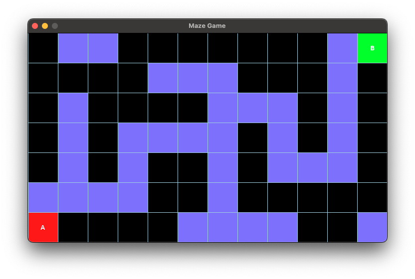
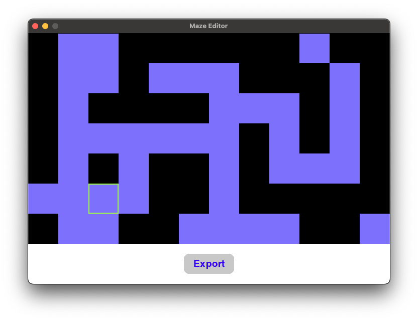

# Maze Game

The game uses a grid-based maze.

- The grid consists of multiple squares.
- **Black square**: obstacles or walls
- **Light blue squere**: unexplored areas
- **A**: starting point
- **B**: destination



## Project Files

```
    ├── colors.py
    ├── constants.py
    ├── editor.py
    ├── main.py
    ├── maze.png
    ├── maze_data.py
    ├── mazes.py
    └── README.md
```

- **colors.py**: defines color constants
- **constants.py**: defines other constants like layout dimensions
- **maze_data.py**: contains map data for this maze
    - **1**: wall
    - **0**: unexplored area
    - **START_POSITION**: tuple contains the (x,y) for starting point
    - **END_POSITION**: tuple contains the (x,y) for ending point
- **main.py**: the main python file
- **editor.py**: maze editor. A tool used to create new or edit an existing maze
- **mazes.py**: stores maze data, used by maze editor

## How to Run

### Maze Game

Depending on your python installation, the Python command could be `python`, `pip` or `python3` and `pip3`


- Install `pygame` if haven't
```
    pip3 install pygame
```

- Run maze
```
    python3 main.py
```

### Maze Editor

```
python3 editor.py
```

Maze editor allows you to create a new maze or make changes to an existing maze.

Be default, it pulls `maze_data1` list from `mazes.py`. Displays it in window. User click on cells to flip it between 'wall' and 'unexplored'.

Once finished, user can click `Export` button to save the result to `mazes.py`.




You can also start with a new maze:

```
python3  ./editor.py --new
```

`--new` option tells the tool to create and display a random maze. The new maze will use the pre-defined NUM_ROWS and NUM_COLS for dimension.

#### ArgumentParser

In `editor.py` we introduced a new module `arguparse`. 

The argparse module in editor.py is used to handle command-line arguments for the script. Here's a breakdown of its usage:

1. Importing argparse: The script imports the argparse module to enable parsing of command-line arguments.
2. Creating an ArgumentParser:
    ```
    parser = argparse.ArgumentParser(description="Maze Editor")
    ```
3. Adding an Argument:
    ```
    parser.add_argument(
        "--new", action="store_true", help="Start with a new maze"
    )
    ```
    - The `--new` argument is added to the parser.
    - `action="store_true"` means that if the `--new` flag is provided, the value of this argument will be True. If the flag is not provided, the value will be False.
    - The help parameter provides a description of the argument, which is displayed when the user runs the script with the --help flag.
4. Parsing Arguments:
    ```
    args = parser.parse_args()
    ```
    - The parse_args() method processes the command-line arguments and stores them in the args object.
5. Using the Parsed Argument:
    ```
    run(args.new)
    ```
    - The value of args.new (either True or False) is passed to the run function. If --new is provided, the script starts with a new maze; otherwise, it uses the existing maze data.

## Assignments

- Try run Maze Editor and create your maze.
- Read and try to understand all the code. Write down your questions and throw them on next class.
- Custom Dimension
    - when create a new maze with `--new` option, instead of using the default number of rows and columns, we want to allow user to provider the desired rows and columns.

    - This can be achieved in two ways
    - ArugmentParser
    You can add new arugments for rows and cols, for example:
    ```
    parser.add_argument(
        "--rows", type=int, help="Number of rows for the new maze (required if --new is used)"
    )
    ```
    - UserInput 

    We can use `input()` to ask user for rows and cols. For example:
    ```
    num_rows = int(input("Enter the number of rows for the new maze: "))
    ```