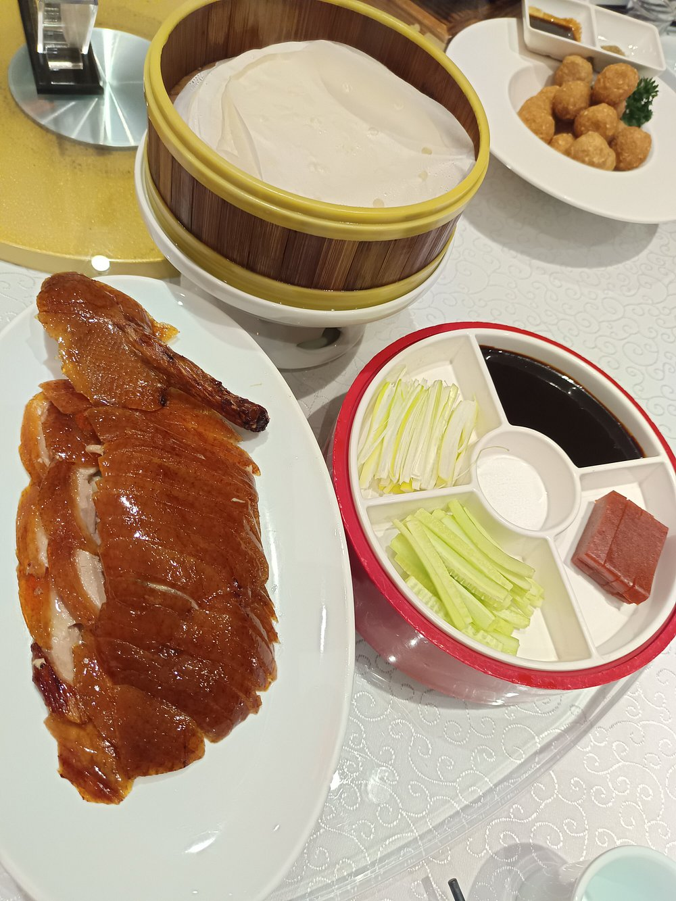

# 🇨🇳 2025年暑期中国行 - 全部行程与配套信息汇总（含三套方案、交通、住宿、美食及注意事项）

## 👨‍👩‍👧‍👦 基本信息

- **旅客组成**：
  - 中国籍母亲
  - 两名美国籍孩子（13岁和19岁）
- **居留地**：天津（姥姥姥爷家）
- **抵达时间**：2025年6月6日（周五）晚上20:30，北京首都国际机场
- **返航时间**：2025年6月28日（周六）早上08:20，北京首都国际机场
- **支付现状**：尚未开通中国手机卡/银行账户，暂无法使用微信/支付宝
- **出行偏好**：优先考虑高铁，避免飞机
- **旅行节奏**：轻松休闲为主，避免行程过于紧凑
- **重点景点**：
  - 北京：故宫、颐和园
  - 有兴趣的城市：成都、重庆、张家界（参考小红书/抖音热门地）

---

## 准备篇：手机与支付账户开通

### 1. 办理中国手机号
- 抵达北京机场后，可在机场的中国移动/联通/电信营业厅购买**实名制**预付费 SIM 卡。
- 需要材料：护照＋在华停留证明（如酒店确认单或亲属邀请函）。
- 推荐套餐：30天不限流量，月租约 ¥100。

### 2. 开通微信支付／支付宝
- 注册微信或支付宝账号，在“我 → 钱包 → 银行卡”中绑定中国银联储蓄卡。
- 若未开卡，可在抵达天津后到**工商银行、招商银行、中国银行**等柜台办理储蓄卡（需护照+住址凭证）。

### 3. 淘宝支付／其他服务
- 一旦微信/支付宝绑定银行卡，即可使用淘宝、美团、滴滴等。
- 可考虑注册“云闪付”App，也可扫码付款。
---

## ✨ 方案一：天津探亲 + 北京文化游 + 张家界自然探险

### 📅 行程安排

| 日期 | 地点 | 活动 |
|------|------|------|
| 6月6日 | 北京 → 天津 | 晚上抵达首都机场，乘高铁前往天津 |
| 6月7日 - 6月9日 | 天津 | 探亲、休整，陪伴姥姥姥爷 |
| 6月10日 | 天津 → 北京 | 乘高铁前往北京，入住酒店 |
| 6月11日 | 北京 | 上午参观故宫，下午游览颐和园 |
| 6月12日 | 北京 → 张家界 | 乘高铁前往张家界 |
| 6月13日 - 6月15日 | 张家界 | 游玩森林公园、天门山、玻璃栈道等 |
| 6月16日 | 张家界 → 天津 | 返回天津休整 |
| 6月17日 - 6月27日 | 天津 | 继续陪伴老人 |
| 6月28日 | 天津 → 北京机场 | 早晨出发返美 |

### 🏨 推荐住宿

#### 北京
- **王府井希尔顿酒店**
  - 地址：北京市东城区王府井东街8号
  - 电话：+86 10 5812 8888

#### 张家界
- **天门山希尔顿欢朋酒店**
  - 地址：张家界市永定区官黎坪街道南城金座1栋
  - 电话：+86 744 888 5188

### 🍽️ 美食推荐

#### 北京
- **全聚德烤鸭（前门店）**
  - 地址：北京市东城区前门大街30号
  - 电话：+86 10 6701 1379

#### 张家界
- **土家风情园餐厅**
  - 地址：张家界市永定区官黎坪街道
  - 电话：+86 744 888 8888

---

## ✨ 方案二：天津探亲 + 成都美食文化游 + 重庆山城体验

### 📅 行程安排

| 日期 | 地点 | 活动 |
|------|------|------|
| 6月6日 | 北京 → 天津 | 晚上抵达，前往天津 |
| 6月7日 - 6月9日 | 天津 | 探亲 |
| 6月10日 | 天津 → 成都 | 乘高铁前往成都 |
| 6月11日 - 6月12日 | 成都 | 游览宽窄巷子、熊猫基地、锦里 |
| 6月13日 | 成都 → 重庆 | 高铁前往重庆 |
| 6月14日 - 6月15日 | 重庆 | 游览洪崖洞、磁器口古镇、解放碑 |
| 6月16日 | 重庆 → 天津 | 返回天津 |
| 6月17日 - 6月27日 | 天津 | 陪伴老人 |
| 6月28日 | 天津 → 北京机场 | 早晨出发返美 |

### 🏨 推荐住宿

#### 成都
- **富力丽思卡尔顿酒店**
  - 地址：成都市锦江区南府街269号
  - 电话：+86 28 8358 8888

#### 重庆
- **尼依格罗酒店**
  - 地址：重庆市江北区庆云路1号国金中心
  - 电话：+86 23 6508 8888

## ✨ 方案三：天津探亲 + 北京 + 成都 + 重庆（经典综合路线）

### 📅 行程安排

| 日期 | 地点 | 活动 |
|------|------|------|
| 6月6日 | 北京 → 天津 | 抵达后前往天津，建议乘坐高铁C2010，约30分钟到达天津南站。 |
| 6月7日 - 6月9日 | 天津 | 探亲，陪伴姥姥姥爷，推荐参观天津古文化街和意式风情区，适合老人同行。 |
| 6月10日 | 天津 → 北京 | 高铁前往北京，建议乘坐C2602，入住酒店后可自由活动。 |
| 6月11日 | 北京 | 上午参观故宫（建议游览时间3小时），下午游览颐和园（建议游览时间2小时）。 |
| 6月12日 | 北京 → 成都 | 高铁前往成都，建议乘坐G87，入住酒店后可品尝成都小吃。 |
| 6月13日 - 6月14日 | 成都 | 游览宽窄巷子、熊猫基地（适合孩子），锦里古街，享用川菜。 |
| 6月15日 | 成都 → 重庆 | 高铁前往重庆，建议乘坐G8667，入住酒店后可夜游洪崖洞。 |
| 6月16日 - 6月17日 | 重庆 | 游览磁器口古镇、解放碑，品尝重庆火锅。 |
| 6月18日 | 重庆 → 天津 | 返回天津，建议乘坐G52，约8小时到达天津南站。 |
| 6月19日 - 6月27日 | 天津 | 陪伴老人，可安排短途游，如盘山或黄崖关长城。 |
| 6月28日 | 天津 → 北京机场 | 早晨出发返美，建议提前预订专车或高铁前往机场。 |

---

## 🚄 高铁出行建议

### 1. 天津 → 北京

| 车次 | 始发站 | 终点站 | 发车时间 | 到达时间 | 运行时间 |
|------|--------|--------|----------|----------|----------|
| C2602 | 天津西 | 北京南 | 05:33 | 06:12 | 39 分钟 |
| C2010 | 天津 | 北京南 | 11:51 | 12:21 | 30 分钟 |

---

### 2. 北京 → 成都

| 车次 | 始发站 | 终点站 | 发车时间 | 到达时间 | 运行时间 |
|------|--------|--------|----------|----------|----------|
| G87 | 北京西 | 成都东 | 07:00 | 14:32 | 7 小时 32 分钟 |
| G55（中转） | 北京西 | 成都东 | 09:55 | 18:28 | 8 小时 33 分钟（西安北转） |

---

### 3. 成都 → 重庆

| 车次 | 始发站 | 终点站 | 发车时间 | 到达时间 | 运行时间 |
|------|--------|--------|----------|----------|----------|
| G8667 | 成都东 | 重庆西 | 00:14 | 01:33 | 1 小时 19 分钟 |
| D3058 | 成都东 | 重庆北 | 06:10 | 08:31 | 2 小时 21 分钟 |

---

### 4. 重庆 → 天津

| 车次 | 始发站 | 终点站 | 发车时间 | 到达时间 | 运行时间 |
|------|--------|--------|----------|----------|----------|
| G52（中转） | 重庆北 | 天津南 | 07:30 | 16:08 | 8 小时 38 分钟（北京西转） |
| G1710 | 重庆北 | 天津西 | 13:07 | 22:34 | 9 小时 27 分钟 |

---

### 5. 天津 → 张家界

| 车次 | 始发站 | 终点站 | 发车时间 | 到达时间 | 运行时间 |
|------|--------|--------|----------|----------|----------|
| G305（中转） | 天津西 | 张家界西 | 11:05 | 21:53 | 10 小时 48 分钟（长沙南转） |
| G292（中转） | 天津 | 张家界西 | 11:08 | 22:34 | 11 小时 26 分钟（长沙南转） |

---

**备注**：
- 实际车次及时间可能因日期调整，建议使用 [12306官网](https://www.12306.cn/) 或 App 查询最新信息并购票。
- 使用官方 App **12306**（https://www.12306.cn/）
- 外籍护照乘客首次乘车需在车站完成身份核验。
---

## 酒店推荐

| 城市 | 酒店                              | 星级 | 地址                                                         | 电话                    | 价位（双标/晚）   |
|:----:|:----------------------------------|:----:|:------------------------------------------------------------|:-----------------------|:-----------------|
| 北京  | 如家精选·京城大话剧店               | ★★★  | 北京市东城区广渠门内白桥大街28号                             | App查询                  | ¥350–450         |
|      | 北京金茂JW万豪酒店                  | ★★★★★| 北京市朝阳区建国路83号                                       | +86 10 5908 6688        | ¥1,200–1,500     |
| 成都  | 四川锦江宾馆（东楼）               | ★★★★ | 成都市锦江区人民南路二段80号                                 | (028) 8550 7777         | ¥500–650         |
|      | 成都尼依格罗酒店                    | ★★★★★| 成都市锦江区红星路三段1号国际金融中心3号楼                   | +86 28 8220 8888        | ¥1,000–1,400     |
| 重庆  | 重庆富力艾美酒店                    | ★★★★★| 重庆市南岸区江南大道10号                                     | +86 23 8638 8888        | ¥900–1,200       |
|      | 重庆维也纳国际酒店（北站店）         | ★★★★ | 重庆市渝北区泰山大道东段58号华宇北城中央汇B区                 | +86 23 8891 1999        | ¥400–550         |

**预订**：携程／飞猪／Booking.com → 搜索酒店名＋日期 → 选房 → 微信／支付宝／银联卡支付。

---

## 景点美图推荐

### 北京

*图片来源：小红书/网络*

)
*图片来源：小红书/网络*

### 成都

*图片来源：抖音/小红书*

*图片来源：小红书*

### 重庆

*图片来源：抖音/小红书*

### 张家界

---

## 美食推荐（含菜品图片，参考小红书/抖音热门榜单）

### 北京美食推荐

| 餐厅名称           | 推荐菜品                   | 图片 | 地址                                   | 电话            |
|--------------------|----------------------------|------|----------------------------------------|-----------------|
| 便宜坊烤鸭店（前门店） | 烤鸭、炸酱面、八宝菜              |  | 北京市东城区前门大街77号              | 010-67020868    |
| 大栅栏爆肚冯        | 爆肚、卤煮火烧                  |  | 北京市西城区大栅栏西街93号            | 010-63036487    |
| 东来顺（王府井店）   | 涮羊肉、芝麻酱调料、糖蒜          | %20.jpg) | 北京市东城区王府井大街198号饭店大厦3楼 | 010-65224031    |
| 护国寺小吃（总店）   | 驴打滚、豌豆黄、炒肝、豆汁        | .jpg) | 北京市西城区护国寺大街93号            | 010-66181705    |
| 四季民福烤鸭店（故宫店） | 枣泥山药、酥皮鸭、片皮鸭           |  | 北京市东城区南池子大街11号            | 010-65267369    |

---

### 成都美食推荐

| 餐厅               | 推荐菜       | 图片 | 地址                                            | 电话                    |
|:------------------|:------------|------|:-----------------------------------------------|:-----------------------|
| 陈麻婆豆腐（石人店）| 麻婆豆腐     |  | 成都市青羊区石人南路41号                         | (028) 8609 0238        |
| 龙抄手（春熙路店） | 红油抄手     |  | 锦江区城守街63号（春熙路中山广场东侧）            | 028-8666 6947          |
| 钟水饺（总店）     | 钟水饺       | .jpeg) | 成都市锦江区东大街下东大街段8号                  | 028-8675 1234          |
| 小龙坎老火锅       | 牛油火锅     |  | 大众点评/高德地图检索“小龙坎老火锅”              | —                      |
| 赖汤圆（春熙路店） | 汤圆／甜品   |  | 大众点评/高德地图检索“赖汤圆 春熙路店”            | —                      |

---

### 重庆美食推荐

| 餐厅                         | 推荐菜    | 图片 | 地址                                          | 电话                    |
|:----------------------------|:---------|------|:---------------------------------------------|:-----------------------|
| 小天鹅火锅（解放碑店）       | 麻辣火锅  |  | 渝中区解放碑步行街附近                         | —                      |
| 豆花庄                       | 酸辣豆花  |  | 大众点评/高德地图检索“重庆豆花庄”               | —                      |
| 李记串串                     | 串串香    |  | 大众点评/高德地图检索“李记串串 重庆”             | —                      |
| 洪崖洞六婆大刀腰片           | 大刀腰片  |  | 渝中区洪崖洞景区内                             | —                      |
| 天龙客栈（解放碑店）         | 酸辣粉    |  | 渝中区解放碑商圈                               | —                      |

---

### 张家界美食推荐

| 餐厅名称             | 推荐菜品                           | 图片 | 地址                                      | 电话            |
|----------------------|------------------------------------|------|-------------------------------------------|-----------------|
| 三下锅总店          | 猪肚三下锅、牛肚三下锅、野菜         |  | 张家界市永定区回龙路189号                | 0744-8883888    |
| 土家三妹菜馆        | 酸辣鱼、腊肉炒山野菜、土家扣肉       |  | 张家界市永定区天门山索道下广场斜对面      | 0744-8386868    |
| 禾田居土家餐厅（武陵源） | 酱香排骨、合渣、血粑鸭、腊肉蒸豆腐     |  | 张家界市武陵源区武陵路205号               | 0744-5558880    |
| 胖哥土家烧烤        | 烤茄子、烤鱼、烤牛筋、烤豆干         |  | 张家界市永定区子午西路与中湖路交汇处      | 0744-8381988    |
| 小城故事（武陵源店）  | 擂茶、炸猪皮、酸萝卜炒腊肉           |  | 张家界市武陵源区军地坪街道老磨湾社区1组   | 0744-5611116    |

> 温馨提示：所有图片均为示意，实际以到店为准。美食与景点均参考小红书/抖音热门榜单，建议到店前在小红书/大众点评查看最新评价和排队情况。

---

## 🔒 旅行注意事项

| 类型 | 建议 |
|------|------|
| 证件 | 护照、签证、孩子出生证明复印件 |
| 健康 | 带常用药品、注意饮食卫生 |
| 安全 | 注意贵重物品保管 |
| 支付 | 尽快启用微信/支付宝，携带少量现金 |
| 天气 | 注意防晒、防雨，高温潮湿 |
| 应急 | 记录当地医院和警察局电话，随身携带紧急联系人信息 |

---

## 🛏️ 酒店与票务预订平台推荐

- [携程旅行网 Ctrip](https://www.ctrip.com)
- [去哪儿 Qunar](https://www.qunar.com)
- [飞猪 Fliggy](https://www.fliggy.com)

---

## ✅ 推荐总结

- **方案三最为均衡**：兼顾文化、美食、自然、老人陪伴
- **成都、重庆适合全家出行**，张家界需评估老人体能
- **请至少提前2周订票和酒店**